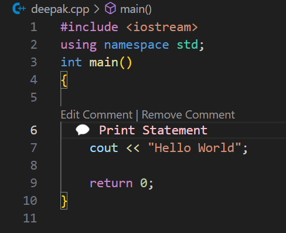

# Offline Comment

## Introduction

The **Offline Comment** allows developers to add, edit, and remove inline comments directly within the code editor. These comments appear alongside your code without modifying the actual source files. It's a handy tool for annotating code during development, code reviews, or when sharing code snippets.

## Why does it exist

Developers often add temporary comments directly into code files during development or code reviews. However, these comments can pollute the git status, leading to accidental commits and pushes of these comments into the repository. This clutters the version history and can also introduce unintended changes into pull requests.

This extension resolves this issue by allowing you to add inline comments that aren't part of the actual source files. By keeping comments separate from the codebase, it prevents accidental inclusion of comments in commits, ensuring a cleaner git status and a more streamlined workflow.

## Features

- **Add Inline Comments**: Insert comments on any line of your code.
- **Edit Comments**: Change existing comments.
- **Remove Comments**: Delete comments that are no longer needed.
- **File-Specific Comments**: Comments associate with specific files and line numbers.
- **Colorful Annotations**: Each comment displays with an assigned color.
- **CodeLens Integration**: Provides convenient access to edit or remove comments directly from the editor.

## Usage

### Adding a Comment
1. Open a file in VSCode where you want to add comments.
2. Place the cursor on the line where you wish to add a comment.
3. Write click in the line where you want to add comment and click `Add Comment`.
4. Enter your comment in the input box that appears and press Enter.

### Editing a Comment

#### Using CodeLens

- Above the line with a comment, click the Edit Comment action.
- Change your comment in the input box and press Enter.

#### Using Command Palette
- Place the cursor on the line with the comment.
- Open the Command Palette and select Update Comment.
- Edit your comment and press Enter.

### Removing a Comment
#### Using CodeLens
- Click on the Remove Comment action preceding the commented line.
- The system removes the comment promptly.
#### Using Command Palette
- Place the cursor on the line with the comment.
- Open the Command Palette and select Remove Comment.
- The system deletes the comment from that line.

### Commands
The extension provides the following commands accessible via the Command Palette:

- Add Comment: Adds a comment to the current line.
- Update Comment: Edits the comment on the current line.
- Remove Comment: Removes the comment from the current line.

## Contributing

Contributions are welcome. 
